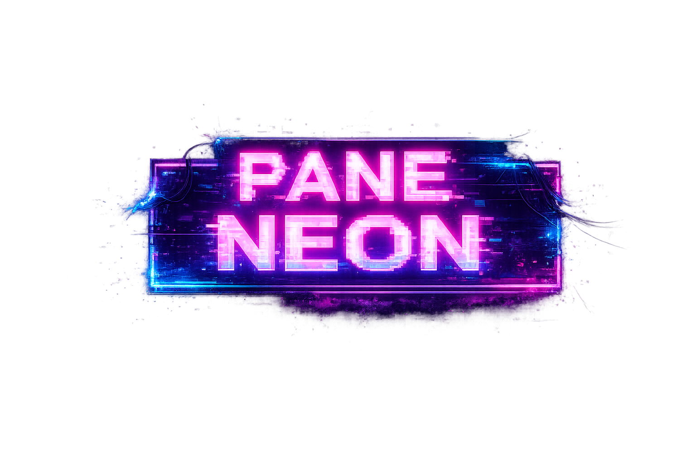

# 🌆 Pane Neon

<p align="center">
  
</p>

---

## 🎮 Sobre o Jogo

**Pane Neon** é um jogo desenvolvido em **JavaScript puro + HTML5 Canvas**, com jogabilidade estilo *endless runner lateral*.

Você corre constantemente enquanto um zumbi te persegue em um mundo neon cyberpunk.

---

## 🎯 Objetivo

Sobreviver o máximo possível.

- Fuja do zumbi 🧟  
- Acumule pontos 🎯  
- Avance pelas fases ⚡  

Se ele te alcançar… acabou.

---

## 🌃 Tema e Atmosfera

- 🌈 Estilo **cyberpunk pixel art**
- 🎨 Cores neon (roxo, azul, rosa)
- 🌑 Ambiente dinâmico:
  - Mais escuro
  - Mais rápido
  - Mais caótico

Quanto mais você joga… mais tenso fica.

---

## 🕹️ Controles

| Ação | Tecla |
|------|------|
| Pular | W ou ↑ |
| Movimento | A / D |

---

## 🎁 Mecânicas do Jogo

- 🧟 Zumbi persegue constantemente
- ❤️ Vida influencia a distância do zumbi
- ⚠️ Se encostar → Game Over
- 🎯 Pontuação aumenta com o tempo

---

## ⚙️ Sistema do Jogo

📋 Requisitos do Sistema
🔹 Requisitos Funcionais
Código	Descrição
RF01	O sistema deve permitir que o jogador realize saltos para desviar de obstáculos durante a corrida.
RF02	O jogador deve iniciar com 3 vidas. Ao colidir com obstáculos perigosos, uma vida deve ser reduzida.
RF03	O jogo deve possuir um sistema de pontuação exibido na tela, incrementado com o tempo e ações do jogador.
RF04	Devem existir itens coletáveis que concedam pontos ou recuperação de vida.
RF05	Devem existir obstáculos que causem dano ao jogador ao colidir.
RF06	O jogo deve possuir 3 fases distintas, com aumento progressivo de dificuldade, baseadas na pontuação.
RF07	O sistema deve possuir um temporizador. Ao final do tempo, o jogador vence.
RF08	O jogo deve conter as seguintes telas: Menu Inicial, Tela de Jogo, Tela de Vitória e Tela de Derrota.
RF09	Deve existir uma tela "Sobre" contendo informações do desenvolvedor e do Product Owner.
RF10	O sistema deve permitir o reinício do jogo após o término da partida.
RF11	O jogo deve possuir efeitos sonoros para ações como pulo, dano, cura e eventos de vitória/derrota.
⚙️ Regras de Negócio
Código	Descrição
RN01	A dificuldade deve aumentar progressivamente a cada fase, elevando a velocidade e/ou a quantidade de inimigos.
RN02	Cada fase deve apresentar um cenário distinto, indicando visualmente a progressão do jogo.
RN03	O jogador vence apenas ao completar a terceira fase com pelo menos 1 vida restante. Caso contrário, deve ser exibida a tela de derrota.
RN04	O jogo deve conter um manual ou seção explicativa com instruções de controle, sistema de pontuação, vidas e funcionamento dos coletáveis.
🛠️ Requisitos Não Funcionais
Código	Descrição
RNF01 (Tecnologia)	O sistema deve ser desenvolvido em JavaScript, compatível com navegadores modernos, sem necessidade de transpilação complexa.
RNF02 (Portabilidade)	O jogo deve ser executado diretamente no navegador utilizando HTML5 Canvas.
RNF03 (Usabilidade)	A interface deve ser otimizada para computadores, com resolução de 1920×1080 px, garantindo visibilidade completa dos elementos.
RNF04 (Desempenho)	O jogo deve manter uma taxa de quadros estável (ex: 60 FPS) para garantir fluidez.


### 📈 Progressão

| Fase | Pontos | Características |
|------|--------|----------------|
| 1 | 0–49 | Velocidade normal |
| 2 | 50+ | Mais rápido + mais escuro |
| 3 | 100+ | Alta velocidade + caos |

---

### ❤️ Sistema de Vida

- Mais vida → mais segurança  
- Menos vida → zumbi mais próximo  

---

### 🎯 Pontuação

- Baseada no tempo de sobrevivência  
- Define avanço de fases  

---

## 🌐 Jogar Agora

🔗 https://pane-neon.vercel.app/

---

## 👨‍💻 Créditos

### Desenvolvedor
**Pietro Francio de Miranda**  
📧 E-mail: pietrof.miranda@gmail.com  
💻 GitHub: https://github.com/pietrofrancio  

---

### Product Owner
**Carlos Roberto da Silva Filho**  
👨‍🏫 Função: Professor

## 🚀 Como Rodar o Projeto

### 1. Clonar
```bash
git clone https://github.com/pietrofrancio/pane_neon.git
```

### 2. Rodar com Servidor
Opção A — Live Server

Clique com botão direito em index.html
Open with Live Server

Opção B — http-server

npx http-server .. 


